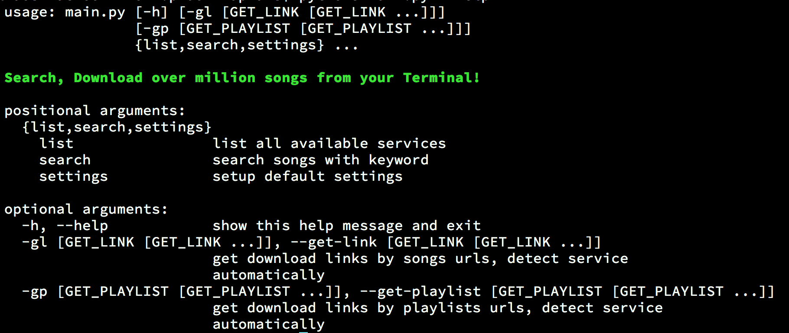

# pidown
Download million songs from Terminal




## Requirements
- Python 3 installed on your system.
- Pip modules: `beautifulsoup4`, `bs4`, `requests`, `urllib3`.


## How to use

First, install required modules:

```
python3 -m pip install beautifulsoup4 bs4 requests urllib3
```

Then clone this repository into your home directory:

```
cd ~
git clone https://github.com/dphans/pidown
cd pidown
```

To get started, run `main.py` script:

```
python3 main.py --help
```
If you see message like below, all things work good:

```
usage: main.py [-h] [-gl [GET_LINK [GET_LINK ...]]]
               [-gp [GET_PLAYLIST [GET_PLAYLIST ...]]]
               {list,search,settings} ...

Search, Download over million songs from your Terminal!

positional arguments:
  {list,search,settings}
    list                list all available services
    search              search songs with keyword
    settings            setup default settings

optional arguments:
  -h, --help            show this help message and exit
  -gl [GET_LINK [GET_LINK ...]], --get-link [GET_LINK [GET_LINK ...]]
                        get download links by songs urls, detect service
                        automatically
  -gp [GET_PLAYLIST [GET_PLAYLIST ...]], --get-playlist [GET_PLAYLIST [GET_PLAYLIST ...]]
                        get download links by playlists urls, detect service
                        automatically
```

### 1. Search for song:

```
python3 main.py search <song name, artist...>
```

### 2. List supported services:

```
python3 main.py list
```

### 3. Change download locations:

```
python3 main.py settings -d path/to/directory
```

### 4. Download song by URL

```
python3 main.py -gl <site url>
```

You can paste many links:

```
python3 main.py -gl link1 link2 link3
```

### 5. Download playlist by URL

```
python3 main.py -gp <site url>
```

You can paste many links:

```
python3 main.py -gp link1 link2 link3
```
